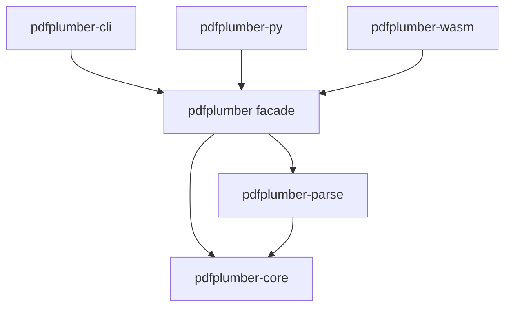

# Workspace and extraction architecture

This guide maps the six-crate workspace, the ownership boundaries between its
layers, and the path taken by one extraction request. It describes the current
source tree rather than an aspirational plug-in system. Ordinary Rust users can
stay at the `pdfplumber` facade; the lower layers are primarily for contributors
and advanced integrations.

## Workspace map

| Crate | Responsibility | Public role |
|---|---|---|
| [`pdfplumber-core`](../crates/pdfplumber-core) | Backend-independent models plus geometry, word, layout, search, image, and table algorithms | Advanced algorithm and model crate; not the ordinary application entry point |
| [`pdfplumber-parse`](../crates/pdfplumber-parse) | `lopdf` object access, page resources, fonts, character maps, tokenization, and content-stream interpretation | Advanced parser crate; its API is separate from the stable facade contract |
| [`pdfplumber`](../crates/pdfplumber) | Input opening, page orchestration, event-to-model conversion, resource accounting, and high-level page methods | Canonical Rust facade and first stable target |
| [`pdfplumber-cli`](../crates/pdfplumber-cli) | Command arguments, file/repair policy, page selection, progress, and text/JSON/CSV output | Native automation and debugging surface |
| [`pdfplumber-py`](../crates/pdfplumber-py) | PyO3 compatibility objects, Python argument semantics, caches, exceptions, dictionaries, and Rust-only namespaces | Python `pdfplumber` migration surface with a separate compatibility contract |
| [`pdfplumber-wasm`](../crates/pdfplumber-wasm) | `wasm-bindgen` wrappers and JavaScript value serialization | Browser and JavaScript/TypeScript surface |

The dependency direction is intentionally one-way. `pdfplumber-parse` depends
on `pdfplumber-core`. `pdfplumber` depends on `pdfplumber-parse` and
`pdfplumber-core`. `pdfplumber-cli`, `pdfplumber-py`, and `pdfplumber-wasm`
depend on the facade. Bindings do not feed back into the facade, parser, or
core. This keeps Python, JavaScript, and command-line compatibility decisions
out of backend-independent extraction algorithms.

## Extension boundaries

### Stable application boundary

Ordinary applications should depend only on the `pdfplumber` facade. `Pdf` is
the canonical input and document type; `Page` owns the extracted objects for
one interpreted page; options, errors, and curated output models are available
from the same crate. The exact committed surface is defined by the
[Rust API contract](rust-api.md), not by every public item in every workspace
crate.

The facade deliberately hides parser event and backend types. That allows the
parser and algorithm crates to evolve without making every internal decision a
high-level compatibility promise.

The source-bound [parser and font limitations](parser-and-font-limitations.md)
guide documents the structural, content-stream, Unicode, metric, warning, and
cross-surface boundaries behind that separation.

### Advanced parser boundary

The [`PdfBackend` trait](../crates/pdfplumber-parse/src/backend.rs) abstracts
document and page access for work directly inside `pdfplumber-parse`.
Implementing `PdfBackend` does not replace the backend inside `pdfplumber::Pdf`;
the current facade constructs and calls `LopdfBackend` directly. A future
facade-level backend injection point would therefore be a separate API design,
not a capability implied by this trait.

[`ContentHandler`](../crates/pdfplumber-parse/src/handler.rs) is a low-level
event callback for characters, painted paths, images, and warnings. Advanced
consumers can use it with a parser backend, but they then own event collection,
coordinate/model conversion, resource policy, and compatibility behavior.
`pdfplumber-core` also supports synthetic pages and direct algorithm use when a
caller already has normalized characters or geometry. Neither path silently
inherits the facade's complete extraction contract.

### Binding boundary

The CLI, Python, and WebAssembly crates call the facade and adapt inputs and
outputs for their host environment. Binding adapters must not change extraction
semantics. They may translate errors, defaults, ownership, page numbering,
dictionary shapes, method names, and serialization only where their public
surface contract requires it.

Surface-specific additions stay at the edge: Python Rust-only capabilities live
under explicit `.rust` namespaces, WebAssembly converts through
`serde_wasm_bindgen`, and the CLI owns terminal formatting and exit codes. A
new core extraction behavior belongs below these adapters and must be tested at
the lowest shared layer first.

## One text extraction request

The following path uses the bytes API because it is shared by native and
WebAssembly callers. The path and reader constructors eventually produce the
same owned document.

1. The caller invokes `Pdf::open_bytes` in the
   [facade document implementation](../crates/pdfplumber/src/pdf.rs). It checks
   the input budget and passes the borrowed bytes to the parser.
2. `LopdfBackend::open` in the
   [default backend](../crates/pdfplumber-parse/src/lopdf_backend.rs) loads or
   repairs the object graph, handles encryption, and records ordered page object
   identifiers.
3. `Pdf::from_doc` reads page boxes and rotations and collects document
   metadata, bookmarks, and the structure tree. It does not interpret page
   content streams.
4. Selection through `Pdf::page` loads one page, creates a facade-owned
   collecting handler, and establishes page geometry and error context.
5. `LopdfBackend::interpret_page` resolves the page content bytes and inherited
   resources, then initializes graphics and text state.
6. `interpret_content_stream` in the
   [interpreter](../crates/pdfplumber-parse/src/interpreter.rs) tokenizes PDF
   operators, resolves fonts and XObjects, advances state, and recursively
   interprets form XObjects within resource limits.
7. The parser emits character, painted-path, image, and warning events through
   `ContentHandler`. The facade collector retains encounter order while keeping
   parser types out of the public page model.
8. The facade converts character events and paths into normalized core models,
   applies page rotation, bidirectional direction, optional normalization and
   deduplication, accounts for cumulative resources, and calls
   `Page::from_extraction` in the
   [page implementation](../crates/pdfplumber/src/page.rs). The result is an
   independently owned `Page`.
9. `Page::extract_text` starts the high-level text request from that page's
   normalized characters.
10. `WordExtractor::extract` in the
    [word algorithms](../crates/pdfplumber-core/src/words.rs) groups characters
    using the requested tolerances and direction rules.
11. For simple text, `words_to_text` in the
    [layout algorithms](../crates/pdfplumber-core/src/layout.rs) groups and
    orders lines. Layout mode instead builds lines and blocks, detects optional
    columns, and selects reading order before rendering text.

Table extraction branches after the owned page exists. `Page::find_tables`
calls `derive_edges`, extracts words where the selected strategy needs them,
and runs `TableFinder::find_tables` from the
[table algorithms](../crates/pdfplumber-core/src/table.rs) before populating
cell text from page characters.

The host surfaces join this same path at the facade boundary. The CLI's
[shared opener](../crates/pdfplumber-cli/src/shared.rs) chooses path, password,
and repair behavior. The [PyO3 adapter](../crates/pdfplumber-py/src/lib.rs)
converts Python paths or binary streams to bytes and wraps the resulting
document. The [WebAssembly adapter](../crates/pdfplumber-wasm/src/lib.rs) passes
a JavaScript byte array to `Pdf::open_bytes` and owns each returned Rust page in
a `WasmPage`.

## Caches, ownership, and recomputation

The word “cache” covers several lifetimes; they are not one shared mutable
system.

| Lifetime | State | Consequence |
|---|---|---|
| Parsed document | `LopdfDocument` owns the `lopdf` graph and its ordered `page_ids` | Opening retains the parsed object graph; it does not retain the caller's path, byte slice, or reader |
| Facade document | `Pdf` eagerly stores `page_widths`, `page_heights`, rotations and boxes, `metadata`, raw metadata, `bookmarks`, and `structure_tree` | Geometry and document views are cheap after opening, while page content remains lazy |
| One interpretation | The parser creates a `font_cache` plus graphics, text, path, and marked-content state | The `font_cache` lives for one content-stream interpretation and is discarded with that call |
| Owned Rust page | `Page` owns normalized characters, shapes, images, annotations, forms, structure elements, and warnings | Read-only word, text, edge, and table methods derive results from the retained page objects |
| Python compatibility wrapper | `PyPdf` has `pages_cache`, `objects_cache`, and `metadata_cache`; each `PyPage` has a native `page_cache` | Python preserves upstream-style object identity and lazy-property behavior at its binding boundary |

There is no shared Rust page-result cache in `Pdf`. A repeated `Pdf::page`
request reinterprets that page and returns a new owned result. The
`Pdf::pages()` view is only a borrowed selector, and its iterator does not retain
pages after yielding them unless the caller does so.

Two `AtomicUsize` counters enforce document-wide cumulative resource budgets
for extracted objects and image bytes. Calls that reach accounting consume
budget even when the same page is requested again, and parallel extraction
shares the same counters. They are safety accounting, not memoization.

In the Python binding, `Page.flush_cache` and `Page.close` clear the native
`page_cache`, so later page access must recompute extraction. Document
`flush_cache` selectively clears `pages_cache` and `objects_cache`; document
`close` clears those compatibility views, recreates the page wrappers expected
by the Python surface, and closes only an internally owned stream. The
`metadata_cache` is independent and remains a converted Python view of the
facade's already cached raw metadata.

## Where a change belongs

| Change | Start here | Why |
|---|---|---|
| PDF syntax, object resolution, font/CMap decoding, or content operator behavior | `crates/pdfplumber-parse/src/` | This layer owns bytes, PDF resources, interpreter state, and emitted events |
| Geometry, character/word grouping, layout, reading order, search, images, or table algorithms | `crates/pdfplumber-core/src/` | These transformations can operate on backend-independent normalized models |
| Opening inputs, page orchestration, coordinate/model conversion, resource budgets, errors, or the stable Rust workflow | `crates/pdfplumber/src/` | The facade composes the parser and core into the application contract |
| Command-line behavior | `crates/pdfplumber-cli/src/` | This surface owns arguments, page-range presentation, output formats, progress, and exit codes |
| Python behavior | `crates/pdfplumber-py/src/` | This surface owns Python argument semantics, compatibility objects, dictionaries, exceptions, and caches |
| JavaScript/WebAssembly behavior | `crates/pdfplumber-wasm/src/` | This surface owns JavaScript names, byte-array entry, `JsError`, and host serialization |

Surface-specific conversion, argument handling, and serialization should remain
in the CLI, Python, or WebAssembly adapter. Shared semantics move downward only
when the lower layer can state and test them without importing a binding or host
runtime. A parser event change should be tested in the parser, its normalized
model effect in the facade, its algorithmic effect in core, and only then its
surface representation in affected bindings.

## Verification

The source-backed architecture contract lives in
[`compat/tests/test_rust_architecture.py`](../compat/tests/test_rust_architecture.py).
It derives the workspace crate inventory from the root manifest, checks every
source link above, locks the ordered text flow and cache lifetimes, and prevents
the stable, advanced-parser, and binding extension boundaries from drifting
without review.
