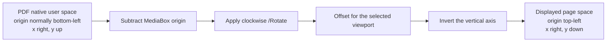
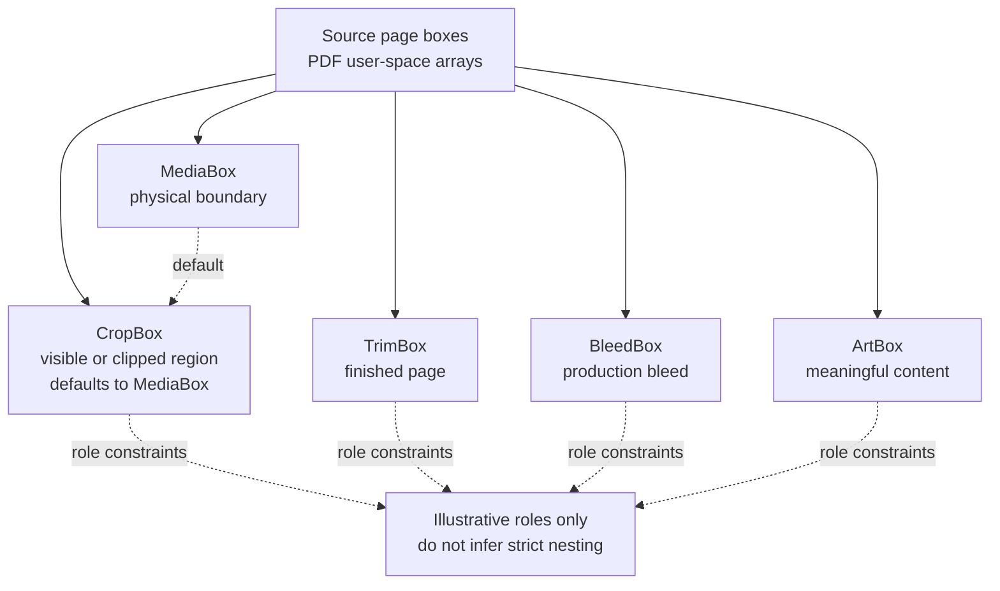
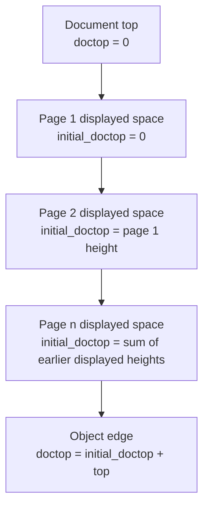

# Coordinate systems and page boxes

Use this guide whenever geometry crosses the PDF file, Rust, WebAssembly, or
Python compatibility boundaries. The short rule is: name the coordinate space,
origin, axis direction, unit, and page view together. A tuple without those
details is not a portable geometry contract.

One PDF point is nominally 1/72 inch. `x` increases to the right in every
documented public surface. The important difference is the vertical axis:
Native PDF user space normally places the origin at the bottom-left and
increases `y` upward. Displayed page space places the origin at the top-left
and increases `y` downward.

## The transform into displayed page space



The parser applies this transform before returning characters, words, painted
geometry, images, tables, annotations, form fields, or search matches. `/Rotate`
is clockwise and is normalized to `0`, `90`, `180`, or `270` degrees. A `90`-
or `270`-degree rotation swaps displayed width and height. Coordinates returned
by Rust, WebAssembly, or the Python compatibility facade already incorporate the
applicable rotation and vertical inversion. Do not apply rotation or the
vertical inversion a second time.

`BBox` means `(x0, top, x1, bottom)` in displayed object geometry:

- `x0` and `x1` are distances from the left edge.
- `top` and `bottom` are distances downward from the page top.
- `width = x1 - x0`.
- `height = bottom - top`.

Displayed boxes should therefore satisfy `x0 <= x1` and `top <= bottom`. The
same field names on a source page-box value do not establish this convention;
the [page-box boundary](#page-boxes-are-source-metadata) below is intentionally
separate.

### Python bottom-origin companions

Python object dictionaries expose both coordinate conventions. `y0` is the
bottom edge measured upward from the page bottom. `y1` is the top edge measured
upward from the page bottom. `top` is the top edge measured downward from the
page top. `bottom` is the lower edge measured downward from the page top.

For an original Python page after pdfminer has applied the page layout matrix,
the compatibility relationship is:

```text
top = mediabox_top + page_height - y1
bottom = mediabox_top + page_height - y0
```

In code and schemas, write these as `top = mediabox_top + page_height - y1`
and `bottom = mediabox_top + page_height - y0`. The `mediabox_top` term matters
for a non-zero MediaBox origin. For a point still expressed in PDF space, use
Python `Page.point2coord(pt)` rather than assuming a zero origin. Derived-page
geometry needs the derived view's explicit contract; crop behavior is deferred
to DOC-007.

## Page boxes are source metadata

PDF page dictionaries can carry five boxes with different roles:

- MediaBox defines the physical page boundary.
- CropBox defines the intended visible or clipped region. It defaults to the
  MediaBox when absent.
- TrimBox defines the intended finished-page boundary.
- BleedBox defines the production bleed boundary.
- ArtBox defines the extent of meaningful page content.

This diagram is illustrative: the boxes are not guaranteed to be concentric or
strictly nested, and equal or offset boundaries are valid cases that callers
must retain.



Page boxes and displayed object boxes use the same four-number Rust container
but cross different boundaries:

| Surface | Page dimensions and object geometry | Page-box behavior |
|---|---|---|
| Rust `Pdf` / `Page` | `width`, `height`, `Page::bbox()`, and extracted model `BBox` values are rotation-aware displayed points with a top-left origin. | `Pdf::page_media_box`, the optional source-box getters, and the corresponding `Page` getters carry PDF user-space source arrays. |
| Python compatibility facade | `Page.mediabox`, `Page.cropbox`, initial `Page.bbox`, dimensions, and object `top`/`bottom` values are rotation-aware and top-origin. | `Page.cropbox` falls back to `Page.mediabox` when the PDF omits CropBox. `Page.bbox` initially equals `Page.mediabox`; a derived crop may change `bbox` without rewriting the original object coordinates. |
| WebAssembly | `width`, `height`, and serialized object `BBox` values follow Rust displayed page space. | WebAssembly does not expose page-box getters. |

Rust source page-box getters preserve PDF array order `[x0, y0, x1, y1]`
inside `BBox` fields. Those four PDF array slots may name diagonally opposite
corners; do not assume their values are already ordered. In contrast,
`Page::bbox()` is the displayed page rectangle `(0, 0, width, height)`. Rust uses
the MediaBox, not the CropBox, for page dimensions and object coordinate
transforms. Its CropBox, TrimBox, BleedBox, and ArtBox values remain source
metadata unless an API explicitly says it has normalized them.

This distinction is easy to miss because the Rust `BBox` type has fields named
`x0`, `top`, `x1`, and `bottom`. A value's producing API, not only its Rust type,
determines whether the second and fourth fields are source PDF `y` slots or
display-space vertical distances. The persistence rule is to keep source
page-box arrays separate from normalized display boxes.

Crop inclusion, clipping, and rebasing semantics belong to DOC-007. This guide
does not promise that a CropBox automatically clips extraction, nor does it
define the older center-based crop behavior.

## Page-local top and document top

`top` is page-local. `doctop` places the same edge in a vertical document view:



The exact relationship is `doctop = initial_doctop + top`. `initial_doctop` is
the sum of displayed heights of preceding pages in the current page view. A
selected-page view therefore has its own document stack. Do not compare
`doctop` values from different document or selected-page views without retaining
the view identity.

Rust and WebAssembly object models expose displayed `BBox` geometry without
Python `y0` and `y1` companions. Rust character and word models do expose
`doctop`; other objects remain page-local unless their API documents a
document-space field.

## Boundary and persistence rules

Never infer coordinate space from a field named only `bbox`. For logs,
databases, messages, and public schemas, prefer names that carry the complete
meaning:

| Meaning | Example field name |
|---|---|
| Displayed object box | `bbox_display_top_left_points` |
| Source MediaBox array | `source_media_box_pdf_user_space` |
| Page-local top edge | `top_page_points` |
| Python bottom-origin edge | `y0_page_bottom_points` |
| Document-view top edge | `doctop_document_points` |

At every ingestion boundary:

1. Record the producing surface and page-view identity.
2. Record PDF points as the unit unless the schema explicitly converts them.
3. Normalize source page boxes deliberately; never pass them through an object
   `BBox` path by type alone.
4. Before accepting a record, validate finite values and ordered displayed
   boxes at the boundary.
5. Convert, rotate, or invert exactly once, then persist the resulting space in
   the field name or schema version.

This means coordinate-system documentation is not compatibility evidence and
does not approve a compatibility deviation. Scorecards and pinned differential
tests remain the authorities for a behavioral claim.

## Sources

- Pinned upstream Python page normalization, boxes, object coordinates, and
  derived views: [`pdfplumber` v0.11.10 `page.py`](https://github.com/jsvine/pdfplumber/blob/v0.11.10/pdfplumber/page.py).
- Current displayed `BBox` definition:
  [`pdfplumber-core/src/geometry.rs`](../crates/pdfplumber-core/src/geometry.rs).
- Current native-to-display transform:
  [`pdfplumber-parse/src/page_geometry.rs`](../crates/pdfplumber-parse/src/page_geometry.rs).
- Current Rust page dimensions, source page boxes, rotation, and extraction:
  [`pdfplumber/src/pdf.rs`](../crates/pdfplumber/src/pdf.rs).
- Current Rust page accessors:
  [`pdfplumber/src/page.rs`](../crates/pdfplumber/src/page.rs).
- Current Python binding normalization and conversion:
  [`pdfplumber-py/src/lib.rs`](../crates/pdfplumber-py/src/lib.rs).
- Current WebAssembly surface:
  [`pdfplumber-wasm/src/lib.rs`](../crates/pdfplumber-wasm/src/lib.rs).
