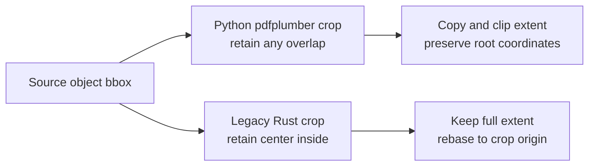
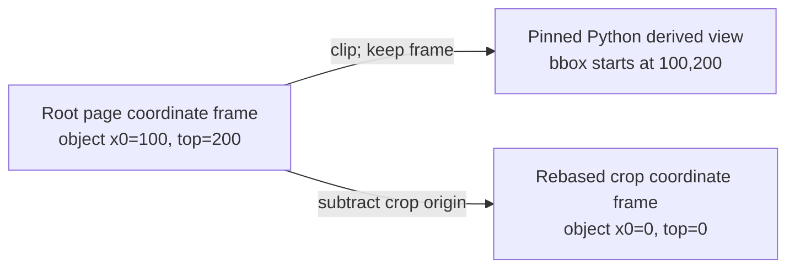

# Crop and derived-page semantics

Cropping is not only a rectangle calculation. A complete contract names which
objects are retained, whether partial objects are clipped, which coordinate
frame survives, what bbox the derived page reports, how nested boxes are
interpreted, and which downstream methods consume that view. This guide keeps
the pinned Python `pdfplumber` v0.11.10 contract separate from the current
legacy Rust behavior.

All boxes below use displayed, top-left-origin PDF points in the order
`(x0, top, x1, bottom)`. See the
[coordinate-system guide](coordinate-systems.md) before converting from native
PDF user space or mixing `top`/`bottom` with Python `y0`/`y1`.

## The two crop models

Pinned Python and current Rust answer different questions. Python asks whether
the object and requested region overlap. Current Rust asks whether the object's
center lies inside the region. An object can therefore be present on one
surface and absent on the other. If both retain it, Python may clip its reported
extent while Rust keeps the complete extent and shifts its coordinates.

The legacy behavior has not been removed from the current Rust API. “Legacy”
identifies the behavior exposed by the pre-parity Rust and Python binding; it
does not mean deprecated or unavailable. This is why a method with the same
name does not establish compatible crop behavior.

## Pinned Python `pdfplumber` v0.11.10

The public call is `crop(bbox, relative=False, strict=True)`. The same
`relative` and `strict` parameters apply to `within_bbox` and `outside_bbox`.

### Inclusion and clipping

- `crop` retains every object with an overlap. It copies each retained object,
  clips the copied object's `x0`, `top`, `x1`, and `bottom` to the overlap,
  recomputes `width` and `height`, and adjusts `doctop` only when clipping moves
  the object's `top`.
- `within_bbox` retains only objects whose complete bounding box is inside the
  requested box. It does not copy or clip a retained object.
- `outside_bbox` retains only objects with no overlap. It likewise does not
  copy or clip a retained object.

Overlap uses the pinned geometry rule: both overlap dimensions must be
non-negative and at least one must be positive. Consequently, touching at one
point is not an overlap, but a zero-width or zero-height edge intersection can
still be an overlap when the other dimension is positive.

Clipping changes the object's extent dictionary. It does not promise to clip
nested geometry such as curve `pts` or `path`, an image stream, or other
object-specific payload. Code that needs those fields clipped must validate
their exact upstream behavior separately rather than deriving it from the four
extent values.

### The derived page bbox

`crop` and `within_bbox` set the derived page's `bbox` to the requested box.
Their `width` and `height` are the differences between that box's edges.
`outside_bbox` preserves the immediate parent page's `bbox`, because the result
is the parent view with one region excluded rather than a view of the exclusion
rectangle.

Pinned Python object coordinates remain in the root page's displayed coordinate
frame; clipping is not rebasing. For a crop `(100, 200, 300, 400)`, a retained
object beginning at the crop's top-left reports `x0=100` and `top=200`, not zero.
Its bottom-origin `y0`/`y1` companions continue to use the root page height, and
its `doctop` remains document-relative except for the exact top-edge adjustment
when a partial object is clipped.

### Absolute and relative nested boxes

With `relative=False`, a nested operation still receives root-page coordinates.
The box is not implicitly relative merely because its parent is already a
`CroppedPage`. With `relative=True`, `bbox.x0` and `bbox.top` are offsets from
the immediate parent page's `bbox` origin; the resolved `x1` and `bottom` receive
the same offsets. The result is then stored in root coordinates.

For example, a parent crop with `bbox == (100, 200, 500, 700)` treats
`child = parent.crop((10, 20, 110, 120), relative=True)` as the root-coordinate
box `(110, 220, 210, 320)`. The equivalent default call is
`parent.crop((110, 220, 210, 320))`.

Every derived page keeps identity as well as geometry: `root_page` remains the
original page and `parent_page` remains the immediate source view. This matters
for nested caches and for determining the bbox against which the next relative
operation is resolved.

### Strict validation

For every operation, strict validation occurs after resolving a relative box.
`strict=True` rejects
zero-area boxes, rejects boxes entirely outside the parent, and rejects boxes
not fully within the parent. Treat the exact `ValueError` message and numeric
representation as part of a Python differential test when application logic
depends on them.

`strict=False` skips those parent-boundary checks; it does not change the
inclusion predicate, so a crop outside the parent can therefore produce an empty
derived view with the requested `bbox`. A partially out-of-parent crop can keep
and clip the objects that overlap the requested box. `outside_bbox` still
reports the parent bbox.

## Current `pdfplumber-rs` surfaces

The current source exposes a mixed migration state, not one shared crop
contract:

| Surface | Inclusion and object coordinates | Derived view and options |
|---|---|---|
| Rust `Page` / `CroppedPage` | Rust `Page::crop` and `CroppedPage::crop` retain an object when its center lies inside the box. They do not clip partially intersecting geometry; they subtract `bbox.x0` and `bbox.top` from retained coordinates. Rust `within_bbox` and `outside_bbox` also rebase retained coordinates. | All three operations return `bbox() == (0, 0, width, height)`. Rust `outside_bbox` uses the exclusion box's dimensions for the returned view. Chained boxes use the immediately preceding rebased view. |
| Python compatibility facade | The Python compatibility facade's `.objects`-backed collections apply overlap clipping in root coordinates for `crop`, full containment for `within_bbox`, and no-overlap selection for `outside_bbox`. | `extract_text`, `extract_words`, and table methods still use the legacy Rust inner view. The current Python methods accept only `bbox`; they do not expose `relative` or `strict`. The complete upstream derived-page API and bbox contract are not implemented. |
| WebAssembly | WebAssembly exposes no crop, region-filter, or `CroppedPage` API. | Do not infer crop support from serialized Rust object boxes. |

In the Rust model, rebasing subtracts the requested `x0` from horizontal
coordinates and the requested `top` from vertical coordinates. Character
`doctop` is also reduced by that `top`, so it no longer carries the pinned
Python root/document relationship. Curves shift their stored `pts`; retained
objects are not geometrically clipped. Coordinates can be negative or extend
beyond the returned view, especially for center-selected or outside objects.

The Python split is particularly important. Properties such as `.chars`,
`.lines`, `.rects`, `.curves`, `.images`, and `.objects` are backed by the
adapter's transformed parent dictionaries. Text, word, and table operations
read the separate Rust `CroppedPage` value. Do not assume that a property's
visible objects are the exact inputs to an extraction method until a pinned
differential test proves that operation.

These are documentation facts, not a proposal to silently rename the Rust
methods. REGION-023 separately tracks whether the rebased-center behavior
should remain as an explicitly named Rust-only API; REGION-024 tracks splitting
legacy extension tests from Python compatibility tests.

## Migration rules

Treat a crop migration as a schema migration, even when all call sites already
say `crop`:

1. Inventory every `crop`, `within_bbox`, and `outside_bbox` call and the
   downstream property or method it consumes.
2. Record whether each input box is root-absolute or parent-relative and
   whether parent-boundary validation is required.
3. Include partial objects, fully contained objects, disjoint objects, edge
   contact, point contact, nested crops, and off-page boxes in reference cases.
4. Compare object presence, the four bbox edges, `width`, `height`, `y0`, `y1`,
   `doctop`, nested geometry, derived bbox, page identity, and downstream text
   or table output separately.
5. Keep the reference environment and rollback path until every required
   operation is exact or its non-exact outcome is explicitly accepted for the
   application. Application acceptance is not an approved compatibility
   deviation.

Use names that carry the coordinate frame and box interpretation across
storage, logs, or messages:

| Meaning | Suggested field |
|---|---|
| Upstream object bbox preserved in root coordinates | `bbox_root_top_left_points` |
| Legacy object bbox rebased to the current view | `bbox_view_top_left_points` |
| Absolute Python crop request | `crop_bbox_root_top_left_points` |
| Relative Python crop request before resolution | `crop_bbox_relative_to_parent_top_left_points` |

Do not compare, join, or serialize root-preserved and rebased coordinates under
one field name. A temporary conversion must identify the source frame, the
crop-view identity, and whether partial geometry was clipped; subtracting an
origin cannot reproduce clipping or inclusion semantics.

## Claim boundary

The versioned compatibility scorecard marks the crop workflow `Not tested`.
Existing source and unit tests establish implementation behavior, but they do
not supply a pinned installed-artifact differential across crop options,
objects, fixtures, failures, and downstream operations. Therefore crop
documentation is not compatibility evidence and does not approve a
compatibility deviation.

REGION-001 through REGION-024 remain open. This guide neither marks those
runtime tasks complete nor changes an extraction result, threshold, tolerance,
fixture, scorecard observation, or approved-delta entry.

## Sources

- Pinned derived-page construction, relative resolution, strict validation,
  bbox selection, and object caching:
  [`pdfplumber` v0.11.10 `page.py`](https://github.com/jsvine/pdfplumber/blob/v0.11.10/pdfplumber/page.py).
- Pinned overlap, clipping, full-containment, and non-intersection helpers:
  [`pdfplumber` v0.11.10 `geometry.py`](https://github.com/jsvine/pdfplumber/blob/v0.11.10/pdfplumber/utils/geometry.py).
- Current Rust center filters, rebasing, view dimensions, and chained behavior:
  [`pdfplumber/src/cropped_page.rs`](../crates/pdfplumber/src/cropped_page.rs) and
  [`pdfplumber/src/page.rs`](../crates/pdfplumber/src/page.rs).
- Current Python adapter object transforms, derived-page methods, and signatures:
  [`pdfplumber-py/src/lib.rs`](../crates/pdfplumber-py/src/lib.rs) and
  [`pdfplumber/_native.pyi`](../crates/pdfplumber-py/python/pdfplumber/_native.pyi).
- Current WebAssembly surface:
  [`pdfplumber-wasm/src/lib.rs`](../crates/pdfplumber-wasm/src/lib.rs).
- Current evidence status: [crop workflow scorecard](compatibility/workflows-v0.3.0.md#crop).
